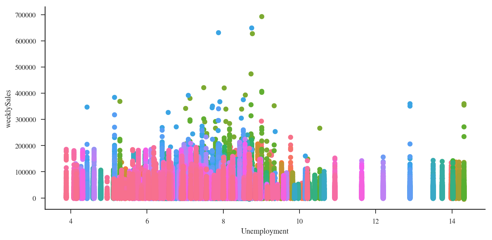
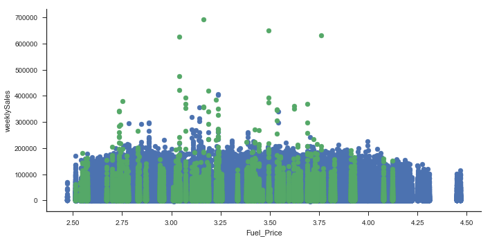
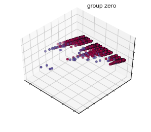
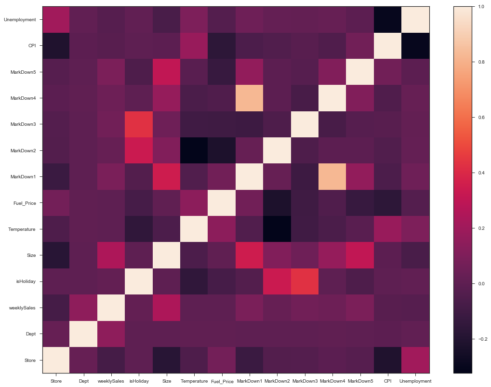

---
#### Publications participated:

##### [DP2-Pub: Differentially Private High-Dimensional Data Publication with Invariant Post Randomization     Aug-2022](https://arxiv.org/abs/2208.11693#:~:text=24%20Aug%202022%5D-,DP2%2DPub%3A%20Differentially%20Private%20High%2DDimensional%20Data,Publication%20with%20Invariant%20Post%20Randomization&text=A%20large%20amount%20of%20high,targeted%20advertising%2C%20and%20reliable%20predictions.)

         Using graph theory and SA (Simulated Annealing) algorithm for 
         the de-anonymization of social media information
      
#####  [Differentially private data publication with multi-level data utility     Dec-2021](https://arxiv.org/abs/2112.07061#:~:text=Conventional%20private%20data%20publication%20mechanisms,privacy%20protection%20on%20sensitive%20data.)

         Using differential privacy for multi-layered data
      
##### [Structure-Attribute-Based Social Network Deanonymization with spectral graph partitioning     May-2021](https://ieeexplore.ieee.org/document/9444401) 

         High-dimensional data differential privacy using randomization and de-randomization

I have a background in Data Analytics in MS from George Washington University and a Statistics BA from the University of Minnesota. 

---
---

#### Haotian Yu's Education Background

M.S., Data Analysis-George Washington University. Washington, DC            Sep 2018 – May 2020  

         SEAS(School of Engineering and Applied Science)  
         
B.A., Statistics-University of Minnesota. Minneapolis, Minnesota             Sept 2014 – May 2017  

B.A., Accounting-Shandong University of Finance and Economics Jinan, China  Sept 2012 – June 2016                        

---
---
        
#### My skill keywords:

•	Data Analytics (Python and R): Machine Learning, NLP, Data Mining and Modeling, Applied Regression Analysis, Sampling Methodology.

•	Data Management: SQL Database management.   

•	Computer Programming Language: Python, R, SQL, JavaScript, Scala, SAS, JAVA, C++, etc.

•	Data warehousing and engineering: MySQL, HQL, Scala Apache Spark & pySpark, MongoDB, etc.

•	Data pipeline, Web crawler, Algorithm development.

---
---
---                

<!-- 
#### [Haotian Yu's Resume](https://github.com/HaotianYu123/HaotianYu123.github.io/blob/master/assets/YHT_Resume.pdf)

### Portfolio

<table class="wide">

<tr>
  <td class="left">
    
  </td>
  <td class="right">
    
  </td>
</tr>

<tr>
  <td class="left">
    
  </td>
  <td class="right">
    
  </td>
</tr>
</table>

  

      <ul class="nav">
          <li><a href="morefigs.html">see more figures</a></li>
      </ul>
  

 -->
