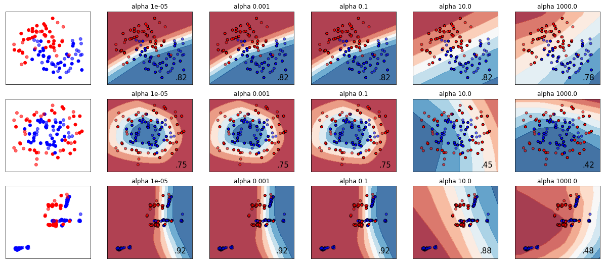

 
### Haotian Yu
  

   

       <ul class="nav">
          <li><a href="https://github.com/HaotianYu123/HaotianYu123.github.io/blob/master/assets/YHT_Resume.pdf">Haotian Yu's cv</a></li>
      </ul>
      <ul class="nav1">
          <li><a href="https://github.com/bsharvey">Haotian Yu's github</a></li>
      </ul>
      <ul class="nav2">
          <li><a href="https://www.linkedin.com/in/haotian-yu-ab954b120/">Haotian Yu's LinkedIn Page</a></li>
      </ul>
   

 
### Haotian Yu's Introduction
I'm a MS student of Data Analytics major in George Washington University. I have background of Statistics in BA in University of Minnesota. I'm good at Data analysis and Data Management.

•	Data Analysis (R and Python): Applied Regression Analysis, Statistical Parametric and Nonparametric analysis, Sampling Methodology.
•	Data Management: SQL Database management.   
•	Computer Programming Language: R, C++, Python, etc.

#### [Haotian Yu's Resume](https://github.com/HaotianYu123/HaotianYu123.github.io/blob/master/assets/YHT_Resume.pdf)

### Portfolio

<table class="wide">
 <tr>
  <td class="left">
    <a href="pages/publpics/iplotCorr.html">
        #####
    </a>
  </td>
  <td class="right">
    
  </td>
</tr>
<tr>
  <td class="left">
    
  </td>
  <td class="right">
    
  </td>
</tr>
</table>

  

      <ul class="nav">
          <li><a href="index.html">back</a></li>
      </ul>
  

